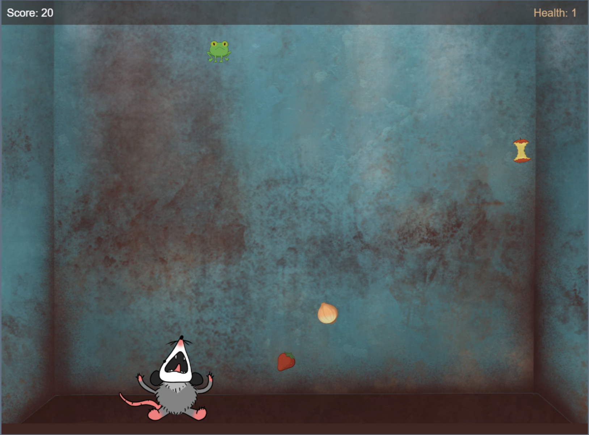
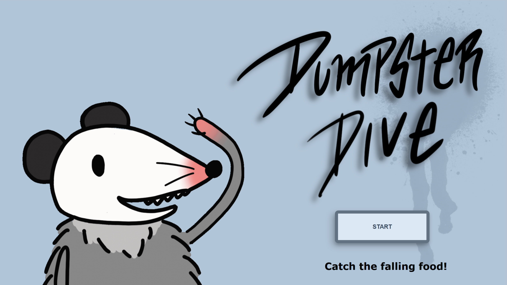
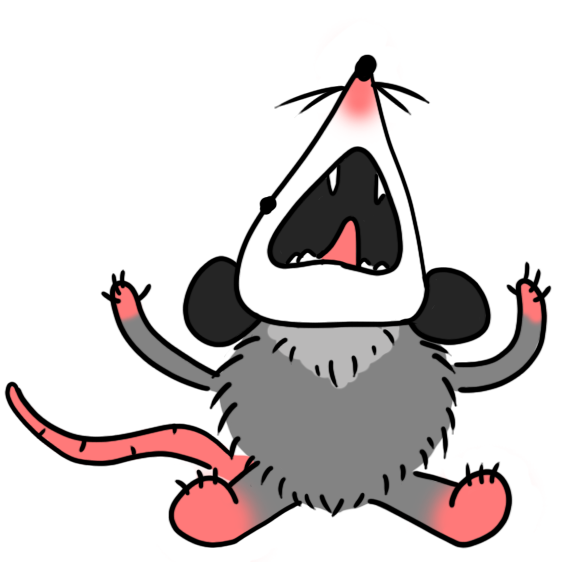
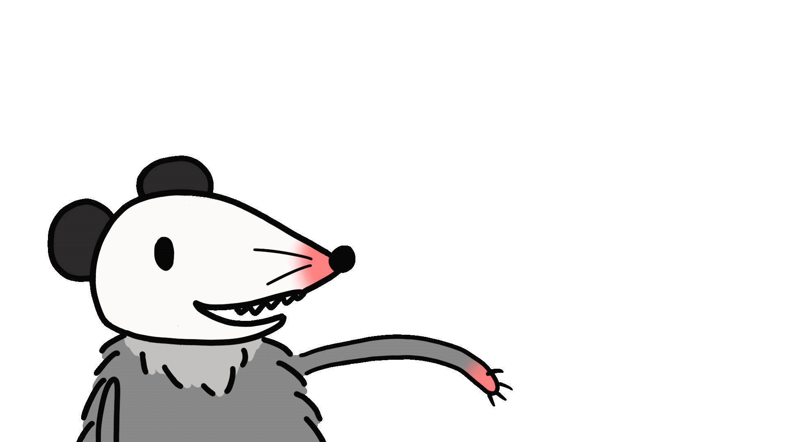
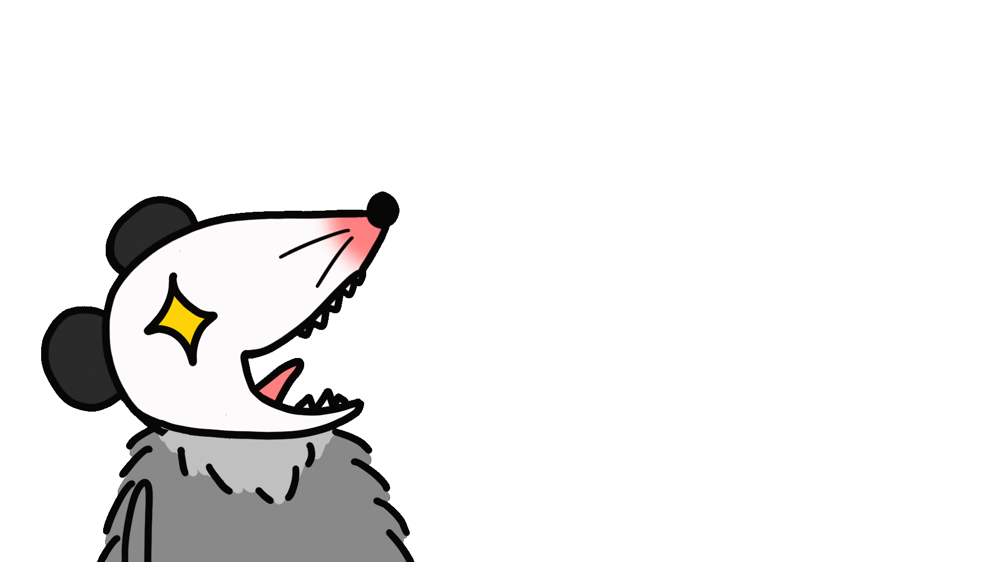
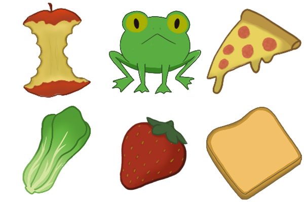
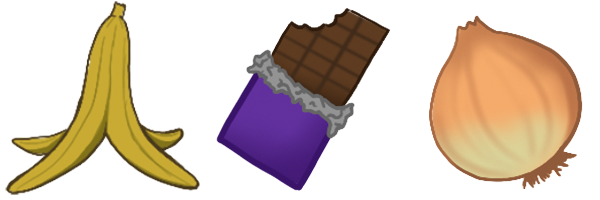

# 🎮 **Dumpster Dive** 

> **Short Pitch**: Collect enough food to feed the little opossum in this simple catcher game. But be careful to make the right choices on what to catch!

## 🕹️ **Game Controls**

> You can use the following input to move the character

⬅️ & ➡️

"A" & "D" keys

mouse input🖱️

---

## 🌐 **Play the Game**
[Click here to play the game!] https://patriciab99.github.io/CCL1/

---

## ‼️**Spoiler**‼️

Do NOT look at the next section if you want to find out which objects you should and shouldn't collect for yourself!!

Good items: 🍎🍞🐸🥬🍓🍕

Bad items: 🍌🍫🧅

End of Spoiler

---

## 📸 **Screenshots**

### Main Gameplay:

  
  
*Figure 1: Example of gameplay in action.*

---

### Start Screen:

  
  
*Figure 2: Start Screen.*

---

## 🎨 **Animations, Character and Objects**
Below are the animations used on the start, win and end screen, as well as the images for the player character and the falling objects in the game:

### Player Character:

  
  
*Figure 3: Player character.*

---
### Start Screen:

  
  
*Figure 3: Start screen animations.*

### 🏆 Win Screen:

  
  
*Figure 4: Win screen animations.*

### 💀 End Screen:

  
  
*Figure 4: End screen animations.*

---
### 🍎✅ Food Objects:

  
  
*Figure 3: Food objects.*

### 🚮❌ Trash Objects:

  
  
*Figure 3: Trash objects.*

---

## ✍️ **Reflection**

### What went well:
- **Creative Design:** The game genre and theme of the game seemed like a good fit that would actually work together nicely. So designing the theme and style came together very naturally, which was an enjoyable process.

### Challenges:
- **Time Constraints:** Implementing all the features I wanted to sadly wasn't possible due to the limited time. I had a prototype of a second level but it still has some bugs that need to be fixed. There were also design elements that I would have liked to add but didn't make it in the final version due to the same reason.
- **Bug Fixes:** Figuring out why the code isn't working the way I wanted to when there were no console errors was really painful at times and probably took away most of the time that would have been needed for other things for this project.

### Lessons Learned:
- **Make plans set small goals:** To me it was very helpful to think about what I would need to do, add or adapt in my code and write the thoughts down in for example a Word document, to sort my thoughts more easily, give them structure and have something to refer to when I get stuck while writing code.
- **Set small goals:** Also working towards smaller goals turned out to be a good thing, so I wouldn't get too frustrated or overwhelmed when dealing with too many problems at once and wanting to achieve something very complicated in the beginning. The better approach for me was to implement small things at a time, check if those work cohesively or not, and figure out the problems one by one along the way and adjust to the changes that happen.
