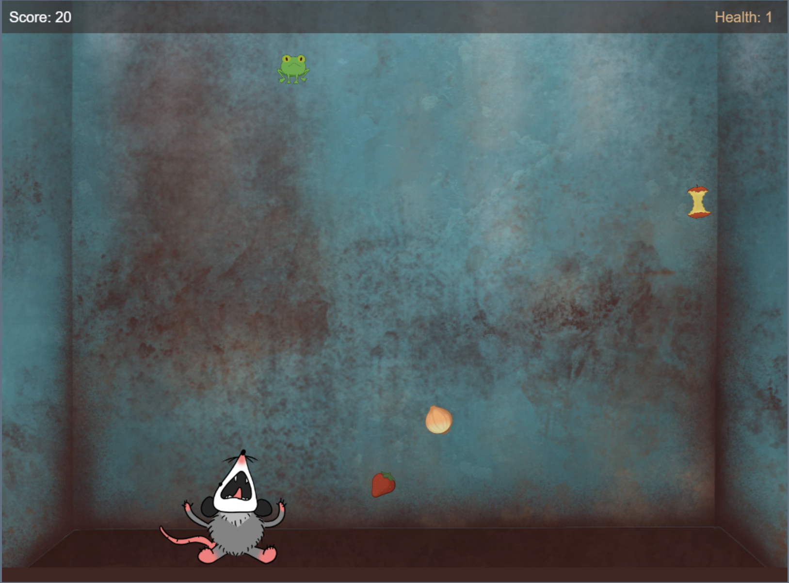

# 🎮 **Dumpster Dive** 

> **Short Pitch**: Collect enough food to feed the little dumpster friends 🦝🐭 in this simple catcher game. But be careful to make the right choices on what to catch!

---

## 🌐 **Play the Game**
[Click here to play the game!](https://your-github-username.github.io/repository-name)

---

## 📸 **Screenshots**

### Main Gameplay:

  
  
*Figure 1: Example of gameplay in action.*

---

### Start Screen:

  
  
*Figure 2: Start Screen.*

---

## 🎨 **Animations, Character and Objects**
Below are the animations used on the start, win and end screen, as well as the images for the player character and the falling objects in the game:

### Player Character:

  
  
*Figure 3: Player character.*

---
### Start Screen:

  
  
*Figure 3: Start screen animations.*

### 🏆 Win Screen:

  
  
*Figure 4: Win screen animations.*

### 💀 End Screen:

  
  
*Figure 4: End screen animations.*

---
### 🍎✅ Food Objects:

  
  
*Figure 3: Food objects.*

### 🚮❌ Trash Objects:

  
  
*Figure 3: Trash objects.*

---

## ✍️ **Reflection**

### What went well:
- **Creative Design:** The game genre and theme of the game seemed like a good fit that would actually work together nicely. So designing the theme and style came together very naturally, which was an enjoyable process.
  
- **Core Mechanics:** The gravity-based gameplay worked better than expected and provided a unique challenge.

### Challenges:
- **Time Constraints:** Implementing all the features we envisioned wasn’t possible due to the limited timeframe.
- **Bug Fixes:** Handling collisions and edge cases for gravity mechanics was tricky.

### Lessons Learned:
- **Prototyping Matters:** Testing early prototypes helped refine the core mechanics quickly.
- **Keep it Simple:** Focusing on one unique mechanic instead of multiple features made the game more polished.
